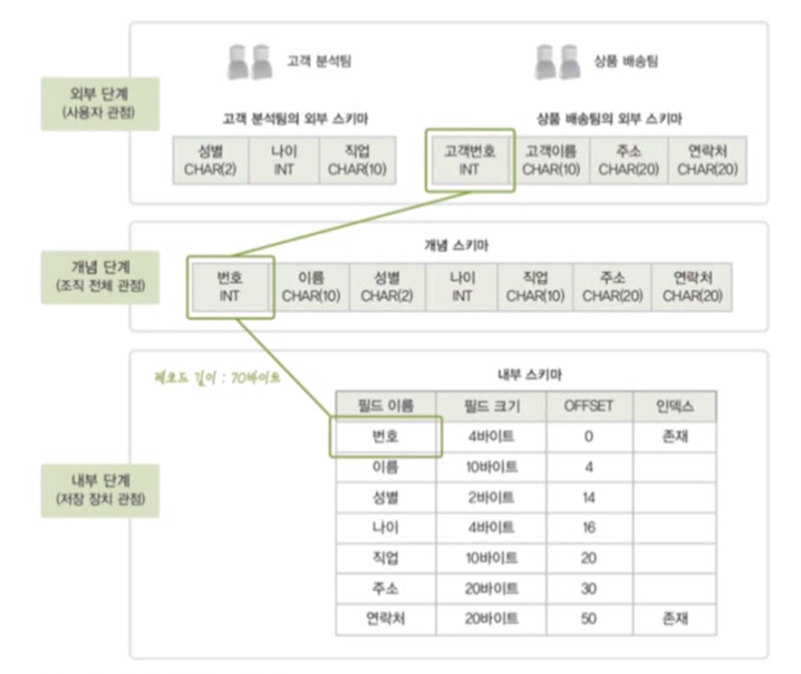

## 데이터베이스 시스템
- 데이터베이스에 데이터를 저장하고, 이를 관리하여 조직에 필요한 정보를 생성해주는 시스템

### 데이터베이스의 구조
- 스키마 - 데이터베이스에 저장되는 데이터 구조와 제약조건을 정의한 것
- 인스턴스 - 스키마에 따라 데이터베이스에 실제로 저장된 값

### 3단계 데이터베이스 구조
데이터베이스를 쉽게 이해하고 이용할 수 있도록 하나의 데이터베이스를 관점에 따라 세 단계로 나눈 것

- 외부 단계 : 개별 사용자 관점
- 개념 단계 : 조직 전체의 관점
- 내부 단계 : 물리적인 저장 장치의 관점

내부 단계에서 외부 단계로 갈수록 추상화 레벨이 높아짐



#### 외부단계
- 데이터베이스를 개별 사용자 관점에서 이해하고 표현하는 단계
- 데이터베이스 하나에 외부 스키마 여러 개 존재할 수 있음
- 각 사용자가 생각하는 데이터베이스의 모습, 즉 논리적 구조로 사용자마다 다르다. 서브 스키마라고도 한다.

#### 개념단계
- 데이터베이스를 조직 전체의 관점에서 이해하고 표현하는 단계
- 데이터베이스 하나에 개념 스키마가 하나만 존재함
- 전체 데이터베이스에 어떤 데이터가 저장되는지, 데이터들 간에는 어떤 관계가 존재하고 어떤 제약 조건이 존재하는지에 대한 정의뿐만 아니라 데이터에 대한 보안정책이나 접근 권한에 대한 정의도 포함

#### 내부단계
- 데이터베이스를 저장 장치의 관점에서 이해하고 표현하는 단계
- 데이터베이스 하나에 내부스키마가 하나만 존재함
- 레코드 구조, 필드 크기, 레코드 접근 경로 등 물리적 저장 구조를 정의


**데이터 독립성**
- 하위 스키마를 변경하더라도 상위 스키마가 영향을 받지 않는 특성

**데이터 사전**
- 시스템 카탈로그라고도 함
- 데이터베이스에 저장되는 데이터에 관한 정보, 즉 메타 데이터를 유지하는 시스템 데이터베이스
    - 메타 데이터 : 데이터에 대한 데이터

- 스키마, 사상 성보, 다양한 제약 조건 등을 저장
- 데이터베이스 관리 시스템이 스스로 생성하고 유지함

**데이터 디렉토리**
- 데이터 사전에 있는 데이터에 실제로 접근하는 데 필요한 위치 정보를 저장하는 시스템 데이터베이스
- 일반 사용자의 접근은 허용되지 않음 

**사용자 데이터베이스**
- 사용자가 실제로 이요하는 데이터가 저장되어 있는 일반 데이터베이스

#### 데이터 언어
사용자와 데이터베이스 관리 시스템 간의 통신 수단
- 데이터 정의어 : 스키마를 정의하거나, 수정 또는 삭제하기 위해서 사용
- 데이터 조작어 : 데이터의 삽입, 삭제, 수정, 검색 등의 처리를 요구하기 위해서 사용
- 데이터 제어어 : 내부적으로 필요한 규칙이나 기법을 정의하기 위해서 사용


## 연습문제

#### 1. 스키마에 대한 설명으로 거리가 먼 것은?
(1) 데이터베이스 시스템에 대한 설명이다.
```
1. 데이터베이스를 운용하는 소프트웨어다.
2. 데이터 사전에 저장된다.
3. 메타 데이터라고도 한다.
4. 데이터베이스에 저장되는 데이터 구조와 제약조건에 대한 정의다.
``` 

#### 2. 3단계 데이터베이스 구조에서 다음 설명과 관련 있는 스키마는?
내부 스키마
```
데이터베이스를 물리적 저장 장치의 관점에서 이해한 구조다. 레코드의 구조, 레코드를 구성하는 필드 크기, 레코드의 물리적 순서, 인덱스를 이용한 접근 경로 등과 같이 실제로 저장되는 방법을 정의한다.
```

#### 3. 3단계 데이터베이스 구조에서 다음 설명과 관련 있는 스키마는?
외부 스키마
```
데이베이스를 사용자 관점에서 이해한 구조다. 각 사용자에게 필요한 데이터베이스의 구조를 정의하여 하나의 데이터베이스에 여러 개가 존재할 수 있다.
```

#### 4. 개념 스키마에 대한 설명으로 옳은 것을 모두 고르시오.
(2) (5) (6)
```
1. 사용자 관점에서 본 데이터베이스의 구조다 - 외부 스키마
2. 조직 전체의 관점에서 본 데이터베이스의 구조다. - 개념 스키마
3. 저장 장치의 관점에서 본 데이터베이스의 구조다. - 내부 스키마
4. 여러 개가 존재할 수 있다. - 외부 스키마
5. 데이터베이스에 저장되는 데이터들 간의 관계와 제약조건을 정의한다. - 개념 스키마
6. 접근 권한, 보안 정책을 정의한다. - 개념 스키마
7. 데이터를 물리적으로 저장하는 방법을 정의한다. - 내부 스키마
8. 서브 스키마라고도 한다. - 외부 스키마
```

#### 5. 데이터베이스 관리 시스템DBMS의 필수 기능 중에서 데이터베이스의 논리적 구조와 물리적 구조 사이의 변환이 가능하도록 두 구조 사이의 대응 관계, 즉 사상을 명세하여 하나의 물리적 구조로 여러 사용자가 요구하는 데이터베이스의 구조를 지원하게 하는 것은 어떤 기능에 포함되는가?
사상 기능

#### 6. 논리적 데이터의 독립성을 설명한 것은?
개별 사용자나 응용 프로그램의 데이터 관점을 변경하지 않고 전체 데이터베이스의 논리적 구조를 변경시킬수 있다.

```논리적 데이터 독립성은 개념 스키마가 변경되더라고 외부 스키마가 영향을 받지 않는 것을 말한다. 전체 데이터 베이스의 논리적인 구조가 변경되어도 관련된 외부/개념 사상 정보만 적절히 수정해주면 직접 관련이 없는 사용자를 위한 외부 스키마는 변경할 필요가 없다.```

#### 7. 물리적 데이터 독립성에 대한 설명으로 가장 적절한 것은?
기존 응용 프로그램에 영향을 주지 않고 데이터베이스의 물리적 구조를 변경할 수 있는 것이다.

```물리적 데이터 독립성은 내부 스키마가 변경되더라도 개념 스키마가 영향을 받지 않는 것을 말한다. 데이터베이스의 저장 구조가 변경되어도 관련된 개념/내부 사상문 적절히 수정해주면 직접적으로 관련이 없는 데이터베이스의 논리적 구조는 영향을 받지 않는다.```

#### 8. 데이터 사전에 대한 설명으로 옳지 않은 것은?
(4) - 데이터 사전은 데이터베이스 관리시스템이 주로 접근하지만 일반 사용자도 접근할 수 있다. 하지만, 수정 및 삭제는 불가능하고 검색만 할 수 있다. 반면에 데이터 디렉터리는 일반 사용자가 접근조차 할 수 없다.
```
1. 데이터 사전에 저장된 데이터를 메타 데이터라고도 한다.
2. 시스템 자신이 필요로 하는 스키마 및 여러 객체에 관한 정보를 저장한다.
3. 사용자가 데이터 사전에 내용을 직접 추가하거나 수정할 수 없다.
4. 시스템 데이터베이스이므로 일반 사용자는 내용을 검색할 수 없다.
```

#### 9. 데이터 사전에 대한 설명으로 옳은 것은?
메타 데이터를 가지고 있는 시스템 데이터베이스로 시스템 카탈로그라고도 한다.

#### 10. 데이터베이스 관리자의 주요 업무완 거리가 먼 것은?
(3) - 응용 프로그램의 개발은 응용 프로그래머의 주요 업무이다.
```
1. 데이터베이스 스키마 정의
2. 보안 및 접근 권한 정책 결정
3. 응용 프로그램의 개발
4. 무결성 유지를 위한 제약조건 정의
```

#### 11. 사용자가 데이터의 삽입, 삭제, 수정, 검색 등의 처리를 데이터베이스 관리 시스템에 요구하기 위해 사용하는 데이터 언어는?
데이터 조작어(DML)

#### 12. 데이터 제어어(DCL)의 기능으로 거리가 먼 것은?
(4) - 스키마 정의는 데이터 정의어(DDL)의 기능이다.
```
1. 무결성 유지
2. 회복 및 동시 공유 제어
3. 접근 제어 및 권한 부여
4. 스키마 정의
```

#### 13. 데이터베이스의 스키마를 정의, 변경, 삭제할 수 있는 데이터 언어는?
데이터 정의어

#### 14. 데이터의 보안, 무결성, 회복과 밀접한 관련이 있는 데이터 언어는?
데이터 제어어

#### 15. 데이터베이스 관리 시스템의 역할에 대한 설명으로 옳지 않은 것은?
(3) - 디스크에 저장된 데이터에 접근하는 것은 운영체제의 기본 기능이므로, 저장 데이터 관리자는 운영체제의 도움을 받아 데이터베이스에 대한 접근을 수행한다.
```
1. 트랜잭션 관리자는 무결성 제약조건 검사, 사용자의 접근 권한 검사, 병행 제어, 회복 등과 관련한 작업을 수행한다.
2. 데이터 조작어로 스키마의 구조를 기술하여 데이터 사전에 저장한 후 필요할 때 활용한다.
3. 저장 데이터 관리자는 디스크에 저장되어 있는 사용자 데이터베이스와 데이터 사전에 대한 접근을 책임진다.
4. DML 컴파일러는 데이터 조작어로 작성된 데이터의 처리 요구를 분석하여 런타임 데이터베이스 처리가 이해할 수 있도록 해석한다.
```

#### 16. 다음은 데이터베이스 관리 시스템의 주요 구성 요소에 대한 설명이다.

```
DDL컴파일러는 데이터베이스 관리자가 명세한 스키마 정의를 해석하고 데이터 사전에 저장한다.

런타임 데이터베이스 처리기는 저장 데이터 관리자를 통해 데이터베이스에 접근하여 데이터 처리 요구를 실제로 실행한다.

DML프리 컴파일러는 응용 프로그램에 삽입된 데이터 조작어를 추출한다.

트랜잭션 관리자는 데이터베이스에 접근하는 과정에서 접근 권한, 무결성 제약 조건 등을 검사한다. 
```


#### 17. 다음 설명에서 A와 B가 각각 무엇인지 답하시오.
A - 스키마  B - 인스턴스
```
A는 데이터베이스에 저장되는 데이터 구조와 제약조건을 정의한 것이다. 그리고 A에 따라 데이터베이스에 실제로 저장된 값을 B라고 한다.
```

#### 18. 다음 설명에서 A가 무엇인지 답하시오.
A - 개념/내부 사상
```
3단계 데이터베이스 구조에서 A는 개념 스키마와 내부 스키마의 대응 관계를 정의한 것으로, 저장 인터페이스라고도 한다.
```

#### 19. 다음 설명에서 A와 B가 각각 무엇인지 답하시오
A - 데이터 독립성  B - 논리적 데이터 독립성
```
A는 하위 스키마를 변경하더라고 상위 스키마가 영향받지 않는 특성을 의미한다. 3단계 데이터베이스 구조에서는 두 가지 유형으로 존재한다. 이 중 개념 스키마가 변경되더라고 외부 스키마가 영향을 받지 않는 것을 B라고 한다.
```

#### 20. 다음 설명에서 A와 B가 각각 무엇인지 답하시오.
A - 데이터 사전 B - 데이터 디렉터리
```
A는 데이터베이스에 저장되는 데이터에 관한 정보를 저장하는 곳으로, 스키마, 매핑 정보, 다양한 제약 조건 등을 저장한다. 그리고 A에 저장되어 있는 정보에 실제로 접근하는 데 필요한 위치 정보는 B에서 관리한다.
```

#### 21. 다음 설명에서 A와 B가 각각 무엇인지 답하시오.
A - 질의 처리기 B - 저장 데이터 관리자
```
데이터베이스 관리 시스템은 내부적으로 사용자의 데이터 처리 요구를 해석하여 처리하는 역할을 담당하는 A와 디스크에 저장되어 있는 사용자 데이터베이스와 데이터 사전을 관리하고 접근하는 역할을 담당하는 B로 구성되어 있다.
```

#### 22. 데이터베이스의 스키마에 대해 간략히 설명하시오.
데이터베이스에 저장되는 데이터 구조와 제약조건을 정의한 것이다.

#### 23. 데이터베이스 시스템이 무엇인지 설명하시오.
데이터베이스에 데이터를 저장하고 관리하여 조직에 필요한 정보를 알려주는 시스템이다.

#### 24. 데이터베이스 시스템의 주요 구성요소 다섯 가지를 설명하시오.

데이터베이스

데이터베이스 관리 시스템

사용자

데이터 언어 - 사용자가 데이터베이스에 접근할 떄 사용 하는 언어

컴퓨터 - 데이터 처리 연산을 담당

#### 25. 데이터 독립성의 의미를 설명하고, 3단계 데이터베이스 구조에서 데이터 독립성을 실현하는 방법을 설명하시오.
데이터 독립성이란 하위 스키마를 변경하더라도 상위 스키마가 영향받지 않는 특성을 의미한다. 3단계 데이터베이스 구조에서는 이를 논리적 데이터 독립성과 물리적 데이터 독립성을 통해 실현한다.

#### 26. 데이터베이스 관리자가 담당하는 주요 업무를 간단히 설명하시오.
데이터베이스 관리자는 데이터베이스 시스템을 운영하고 관리한다. 데이터베이스를 직접 활용하기보다는 조직 내의 사용자를 위해 데이터베이스를 설계 및 구축하고, 제대로된 서비스를 이용할 수 있도록 제어하는 역할을 한다.

#### 27. 데이터 언어를 사용 목적에 따라 세 가지 유형으로 분류하고 각각을 설명하시오.

데이터 정의어(DDL) : 스키마를 정의하거나 수정 또는 삭제

데이터 조작어(DML) : 데이터의 삽입, 삭제, 수정, 검색 등의 처리를 하기 위해 사용

데이터 제어어(DCL) : 내부적으로 필요한 규칙이나 기법을 정의하기 위해서 사용