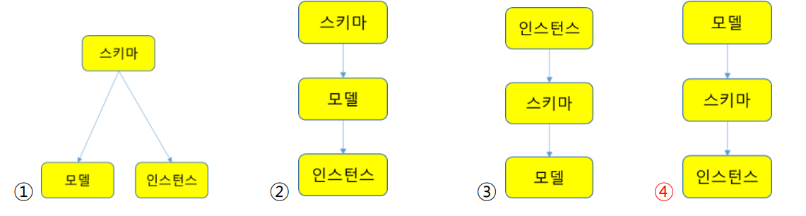
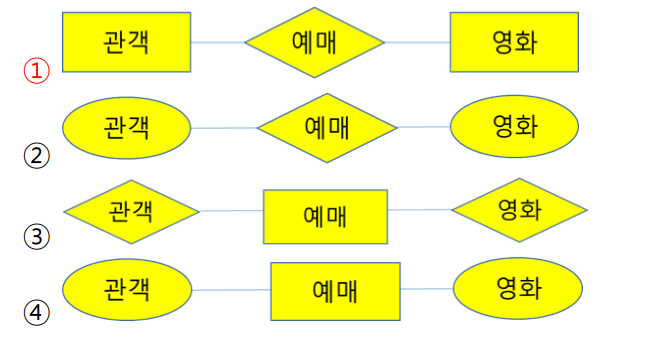
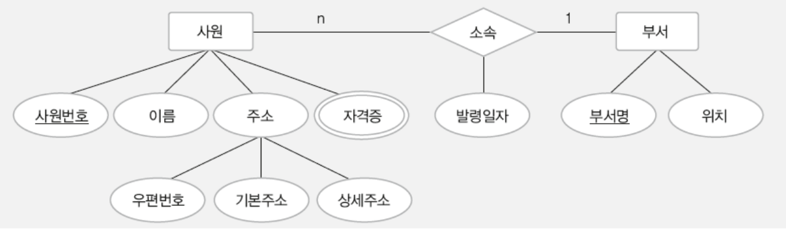
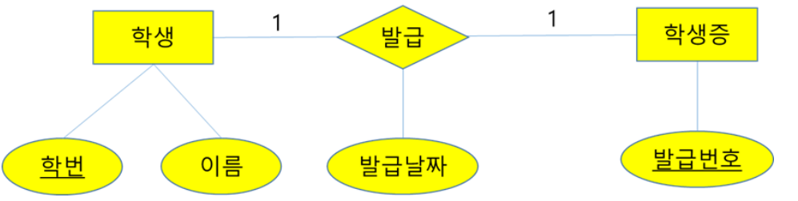

## 데이터 모델링
현실 세계에 존재하는 데이터를 컴퓨터 세계의 데이터베이스로 옮기는 변환 과정
- 개념적 데이터 모델링 : 현실 세계의 중요 데이터를 추출하여 대념 세계로 옮긴다.
- 논리적 데이터 모델링 : 개념 세계의 데이터를 데이터베이스에 저장하는 구조로 표현한다.

## 데이터 모델
데이터 모델링의 결과물을 표현하는 도구, 개념적 데이터 모델과 논리적 데이터 모델이 있다.

데이터 모델은 데이터의 구조, 연산, 제약 조건으로 구성된다.
- 데이터 구조 : 개념적 데이터 모델에서는 현실세계를 개념 세계로 추상화 했을 때 어떤 요소로 이루어져 있는 지를 표현하는 개념적 구조이고, 논리적 데이터 모델에서는 데이터를 어떤 모습으로 저장할 것인지를 표현하는 논리적 구조이다.
- 연산 : 데이터 구조에 따라 개념 세계나 컴퓨터 세계에서 실제로 표현된 값들을 처리하는 작업
- 제약 조건 : 데이터 무결성 유지를 위한 사항들이다.

### 데이터 모델링과 모델 예시

**개념적 데이터 모델링** : 아파트를 지을 때 사람들의 요구사항을 반영하여 설계도를 그리는 과정

**개념적 데이터 모델** : 설계도를 그릴 때 사용하는 방법이나 도구

**논리적 데이터 모델링** : 설계도를 토대로 모델하우스를 만드는 과정

**논리적 데이터 모델** : 모델하우스를 만들 때 사용하는 방법이나 도구


## 개체-관계 모델
개체와 개체 간의 관계를 이용해 현실 세계를 개념적 구조로 표현하는 **개념적 데이터 모델**이다.
- 개체 : 현실 세계에서 조직을 운영하는 데 꼭 필요한 개념적 구조로 표현하는 개념적 데이터 모델이다.
- 속성 : 개체나 관계가 가지고 있는 고유한 특성
    - 단순 속성: 더는 분해할 수 없는 속성
    - 복합 속성: 세분화 할 수 있는 속성(ex. 주소는 시,동,읍 면 등으로 세분화 할 수 있다 - 하지만 단순속성으로 처리도 가능)
    - 단일 값 속성: 특정 개체를 구성하는 속성 값이 하나인 경우(ex. 이름)
    - 다중 값 속성: 속성이 값을 여러개 가질 수 있는 경우(ex. 연락처(집, 휴대전화))
    - 널 속성 : 속성의 값이 아직 결정되지 않았음을 나타낼 수 있는 속성
    - 키 속성 : 개체를 식별하는 데 사용되는 고유한 속성
- 관계 : 개체와 개체가 맺고 있는 의미 있는 연관성
- 개체 타입 : 개체를 고유한 이름과 속성들로 정의한 것

## 개체-관계 다이어그램
- 개체-관계 모델을 이용해 현실 세계를 개념적으로 모델링한 결과물을 그림으로 표현한 것
- E-R 다이어그램이라고도 한다.

### 관계의 종속성
두 개체가 관계에 대해 종속적인 특성을 가지는 경우도 있다. 개체 B가 독자적으로 존재할 수 없고 다른 개체 A의 존재 여부에 의존적이라면, 개체 B가 개체 A에 종속되어 있다고 한다.
- 약한 개체(종속 개체) : 다른 개체의 존재 여부에 의존적인 개체
- 강한 개체(오너 개체) : 다른 개체의 존재 여부를 결정하는 개체

강한개체와 약한 개체는 일반적으로 일대다 관계이다. 그리고 약한 개체는 강한 개체와의 관계에서 필수적으로 참여한다. 약한 개체는 자신이 지닌 속성만으로는 식별이 어려워 일반적으로 강한 개체의 키를 포함하여 키를 구성한다.

## 논리적 데이터 모델
사용자 입장에서 선택한 데이터베이스 관리 시스템에 따라 E-R 다이어그램으로 표현된 개념적 구조르 다음과 같이 데이터베이스에 저장할 형태로 표현한 데이터베이스의 논리적인 구조
- 관계 데이터 모델 : 논리적 구조가 2차원 테이블 형태
- 계층 데이터 모델 : 논리적 구조가 트리 형태
- 네트워크 데이터 모델 : 논리적 구조가 그래프 형태

### 계층 데이터 모델
- 트리 구조의 형태
- 개체들 간의 관계는 링크로 나타내고, 일대다 관계만 표현 가능
- 두 개체 사이에 관계를 하나만 정의할 수 있어 관계에 이름을 붙여 구별할 필요가 없음
- 다대다 관계를 직접 표현할 수 없어 별도의 개체를 추가로 생성하여 표현한다.
- 트리구조이기 때문에 루트 역할을 하는 개체가 존재하고 사이클이 존재하지 않는다.
- 부모 개체는 여러 자식 객체를 가질 수 있지만, 자식 개체는 하나의 부모 개체만 가질 수 있다.

### 네트워크 데이터 모델
- 그래프 구조의 형태
- 개체들 간의 관계는 화살표로 나타내고, 일대다 관계만 표현 가능
- 계층 데이터 모델과는 달리 두 개체간의 관계를 여러 개 정의할 수 있어서 관계를 이름으로 구별한다.
- 다대다 관계를 직접 표현할 수 없어 별도의 개체를 추가로 생성하여 표현한다.
- 일대다 관계의 개체들을 각각 오너와 멤버라 부르고, 계층 데이터 모델과 달리, 오너 개체 하나가 멤버 개체 여러 개와 관계를 맺을 수 있고, 멤버 개체도 오너 개체 여러 개와 관계를 맺을 수 있다.
- 개체들 사이의 관계를 2개 이상 표현할 수 있어서 계층 데이터 모델보다 개념적 구조를 논리적 구조로 좀 더 자연스럽게 모델링할 수 있으나, 구조가 훨씬 복잡해 질 수 있어서 데이터의 삽입/삭제/수정/검색의 작업이 어려워 지는 문제가 발생한다.


## 연습 문제

#### 1. 데이터 모델의 개념으로 가장 적절한 것은?
현실세계의 데이터 구조를 컴퓨터 세계의 데이터 구조로 기술하는 도구다.

#### 2. 데이터 모델의 구성 요소로 거리가 먼 것은?
(4) - 데이터 모델은 구조, 연산, 제약 조건으로 구성된다
```
1. 데이터 구조
2. 연산
3. 제약 조건
4. 관계
```

#### 3. 데이터 모델의 구성 요소 중 데이터 구조에 따라 실제로 표현된 값들을 처리하는 작업을 의미하는 것은?
연산

#### 4. 데이터 모델에 대한 다음 설명 중 빈칸에 적합한 것은?
제약 조건
```
데이터 모델은 논리적인 데이터 구조, 데이터 구조에서 처리 가능한 연산, 데이터 구조와 연산에 대한 (   )을 구성 요소로 포함하고 있다.
```

#### 5. 데이터 모델, 스키마, 인스턴스 간의 관계를 그림으로 표현한다면?


#### 6. 개체-관계 모델에 대한 설명으로 옳지 않은 것은?
(2) - 사용하는 DBMS의 종류에 영향을 받지 않는다.
```
1. 개체, 속성, 개체 간의 관계를 이용해 현실 세계를 개념적 구조로 표현한 방법이다.
2. 사용하는 DBMS의 종류에 영향을 받는다.
3. 1976년 Peter Chen이 제안하였다.
4. E-R 다이어그램을 통해 시각적으로 표현한다.
```

#### 7. 개체-관계 모델에 대한 설명으로 옳지 않은 것은?
(3) - 관계는 개체들에 대한 연관성을 의미한다.
```
1. 개체는 현실 세계에서 개념적 또는 물리적으로 존재하는 구별 가능한 모든 것을 의미한다.
2. 속성은 개체가 가지고 있는 고유의 특성이다.
3. 관계는 속성들에 대한 연관성을 의미한다.
4. 일대일 1:1, 일대다 1:n, 다대다 n:n 관계를 모두 표현할 수 있다.
```

#### 8. 다음 중 개체에 대한 설명으로 옳지 않은 것은?
(4) - 개체는 여러가지 속성을 가질 수 있다.
```
1. 개체는 데이터베이스에 저장할만한 중요한 데이터를 가지고 있는 현실 세계의 모든 대상을 의미한다.
2. 개념적으로만 존재하는 대상도 개체가 될 수 있다.
3. 개체는 다른 개체와 의미 있는 관계를 맺을 수 있다.
4. 개체에는 단 하나의 속성만이 허용된다.
```

#### 9. 데이터의 가장 작은 논리적 단위로서, 파일 구조에서 필드에 해당하는 것은?
속성

#### 10. 개체를 구성하고 있는 속성들이 실제로 값을 가지면서 실체화된 개체를 무엇이라 하는가?
개체 인스턴스


#### 11. 개체 집합 A의 각 개체 인스턴스가 개체 집합 B의 개체 인스턴스 여러 개와 관계를 맺을 수 있지만, 개체 집합 B의 각 개체 인스턴스는 개체 집합 A의 개체 인스턴스 하나와만 관계를 맺을 수 있음을 의미하는 것은?
1:n

#### 12. 개체 집합 A의 각 개체 인스턴스는 개체 집합 B의 개체 인스턴스 여러 개와 관계를 맺을 수 있고, 개체 집합  B의 각 개체 인스턴스도 집합 A의 개체 인스턴스 여러 개와 관계를 맺을 수 있음을 의미하는 것은?
n:n

#### 13 - 15. E-R 다이어그램의 구성 요소와 의미를 올바르게 연결하시오.
```
1. 사각형 - 개체
2. 타원 - 속성
3. 마름모 -관계
선 - 개체와 속성을 연결
```

#### 16. 관객과 영화 개체 간의 예매 관계를 E-R다이어그램으로 옳게 표현 한 것은?


#### 17. 병원에서 의사와 환자의 관계를 표현한 E-R다이어그램이다. 이에 대한 설명으로 옳지 않은 것은?
(3) - 환자 한 명은 한 명의 의사에게 진료를 받을 수 있다. 


```
1. 의사 개체와 환자 개체는 일대다 관계다.
2. 의사 한명이 여러 명의 환자를 진료할 수 있다.
3. 환자 한 명이 여러 명의 의사에게 진료를 받을 수 있다.
4. 의사는 반드리 환자를 진료해야 한다.
```

#### 18. 회사에서 직원과 부양가족의 관계를 표현한 E-R 다이어그램이다. 이에 대한 설명으로 옳지 않은 것은?
(4) - 부양하는 직원이 무조건 1명 있어야 한다.


```
1. 직원 개체와 부양가족 개체는 일대 다 관계이다.
2. 부양가족 개체는 독자적으로 존재할 수 없고 직원 개체에 종속되어 있다.
3. 한 명의 직원이 여러 부양가족을 부양할 수 있고, 부양가족이 없는 직원도 있을 수 있다.
4. 부양가족은 한 명의 직원이 부양하거나, 부양하는 직원이 없을 수도 있다.
```

#### 19. 논리적 데이터 모델에 해당하지 않는 것은?
(1) - 논리적 데이터 모델은 계층 데이터 모델, 네트워크 데이터 모델, 관계 데이터 모델이 있다.
```
1. 개체 - 관계 데이터 모델
2. 계층 데이터 모델
3. 네트워크 데이터 모델
4. 관계 데이터 모델
```

#### 20. 논리적 데이터 모델에 대한 설명으로 적합한 것은?
데이터베이스의 논리적 구조를 표현한다.

#### 21. 계층 데이터 모델은 데이터베이스의 논리적 구조가 어떤 형태인가?
트리

#### 22. 계층 데이터 모델에 대한 설명으로 옳지 않은 것은?
(2) - 부모 개체와 자식 개체는 일대다 관계다
```
1. 데이터베이스의 논리적 구조를 트리 형태로 표현한다.
2. 부모 개체와 자식 개체는 일대일의 관계다
3. 다대다 관계를 직접 표현할 수 없다.
4. 사이클이 존재하지 않는다.
```

#### 23. 네트워크 데이터 모델은 데이터베이스의 논리적 구조가 어떤 형태인가?
그래프

#### 24. 네트워크 데이터 모델에 대한 설명으로 옳지 않은 것은?
(2) - 네트쿼워크 데이터 모델에서도 계층 데이터모델처럼 일대다 관계만 직접 표현할 수 있다.
```
1. 데이터베이스의 논리적 구조를 그래프 형태로 표현한다.
2. 일대일, 일대다, 다대다의 관계를 모두 직접 표현할 수 있다.
3. 오너 개체와 멤버 개체가 존재한다.
4. 개체 간의 관계를 여러 개 정의할 수 있다.
```

#### 25. 계층 데이터 모델과 네트워크 데이터 모델의 가장 큰 차이는 무엇인가?
관계를 표현 하는 방법 - 네트워크 데이터 모델에서는 계층 데이터 모델에서와 달리 오너 개체 하나가 멤버 개체 여러개와 관계를 맺을 수 있고, 맴버 개체도 오너 개체 여러 개와 관계를 맺을 수 있다.


#### 26. 현실 세계에 존재하는 데이터를 컴퓨터 세게의 데이터베이스로 변환하는 데이터 모델링의 결과물을 표현하는 도구를 무엇이라 하는가?
데이터 모델

#### 27. 개체-관계 모델을 제안한 사람은 누구인가?
Peter. Chen

#### 28. 개체 관계 모델에 대한 다음 설명을 읽고, A B C의 빈칸을 적절히 채우시오.
A - 개체  B - 속성  C - 개체 타입

```
A는 현실 세계에서 어떤 조직을 운영하는 데 꼭 필요한 사람, 사물과 같이 구별되는 모든 것을 의미한다. 그리고 A가 가지고 있는 고유의 특성을 B라 하고, A를 고유의 이름과 B를 가지고 정의한 것을 C라고 한다.
```

#### 29. 속성은 다음과 같이 다양한 기준으로 분류할 수 있다. 각 설명이 의미하는 속성이 무엇인지 알맞게 고르시오.

```
(1) 여러 개의 더 작은 의미로 분해가 가능한 속성 - 복합 속성
(2) 다른 속성의 값으로부터 새롭게 유도되어 결정되는 속성 - 유도 속성
(3) E-R 다이어그램에서 이중 타원으로 표현되는 속성 - 다중 값 속성
(4) 의미를 더는 분해할 수 없는 속성 - 단순 속성
```

#### 30. 개체-관계 모델을 이용해 현실 세계를 개념적으로 모델링하여 개체, 속성 개체 간의 관계를 그림으로 표현한 것을 무엇이라 하는가?
개체-관계 다이어그램 or E-R 다이어그램


#### 31. 다음 E-R 다이어그램을 보고 각 물음에 답하시오.


```
(1) 개체를 찾아 나열하시오
사원 부서

(2) 단순 속성을 찾아 나열하시오.
이름, 발령일자, 부서명, 위치

(3) 복합 속성을 찾아 나열하시오.
주소

(4) 다중 값 속성을 찾아 나열하시오.
자격증

(5) 키 속성을 찾아 나열하시오.
사원번호, 부서명

(6) 관계를 찾아 나열하시오.
소속
```


#### 32. 다음 E-R 다이어그램을 보고 각 물음에 답하시오.


```
(1) 다른 개체의 존재 여부에 의존적인 개체를 무엇이라 하는지 답하고, 위의 E-R 다이어그램에서 그러한 개체를 찾아보시오.
약한 개체(종속 개체), 학부모

(2) 다른 개체의 존재 여부를 결정하는 개체를 무엇이라 하는지 답하고, 위의 E-R 다이어그램에서 그러한 개체를 찾아보시오.
강한 개체(오너 개체), 학생
```

#### 33. 데이터 모델링과 데이터 모델이 무엇인지 설명하시오.
데이터 모델링은 현실 세계에 존재하는 데이터를 컴퓨터 세계의 데이터베이스로 옮기는 과정을 의미하고, 데이터 모델은 데이터 모델링의 결과물을 표현하는 도구를 의미한다.

#### 34. 데이터 모델링의 과정을 두 단계로 나누어 설명하시오.
데이터 모델링은 현실 세계의 중요 데이터를 추출하여 개념 세계로 옮기는 개념적 데이터 모델링 단계와 개념 세계의 데이터를 데이터베이스에 저장하는 구조로 표현하는 논리적 데이터 모델링의 단계를 통해 이루어진다.

#### 35. 고객 개체와 이벤트 개체 간의 참여 관계가 있고, 고객 한 명이 여러 이벤트에 참여할 수 있으며, 이벤트 하나에 여러 고객이 참여할 수 있다고 할 때 이 내용을 E-R 다이어그램으로 표현하시오.


#### 36. 다음은 어느 학교에서 학생에게 학생증을 발급하는 업무에 대해 설명한 내용이다. 이 내용을 읽고 E-R 다이어그램으로 표현하시오.

```
- 학생 개체와 학생증 개체는 발급 관계가 있다.
- 학생 개체는 학번과 이름 속성을 가지고 있다. 이 중에서 학번이 키 속성이다.
- 학생증 개체는 키 속성인 발급 번호 속성만 가지고 있다.
- 발급 관계는 발급날짜 속성을 가지고 있다.
- 학생 한 명은 학생증 1개만 발급받을 수 있고, 학생증도 학생 한 명에게만 발급될 수 있다.
```


