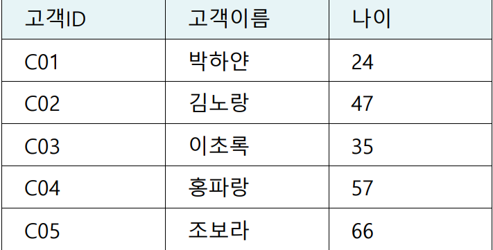
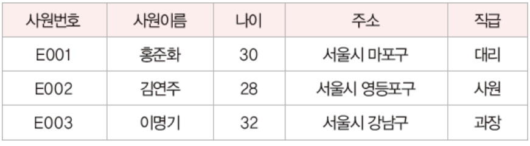
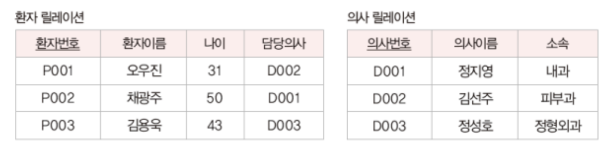
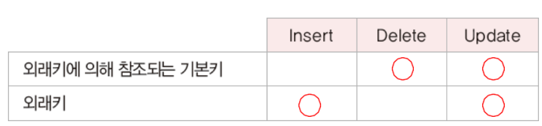

## 관계 데이터 모델
  개념적 구조를 논리적 구조로 표현하는 논리적 데이터 모델

- 릴레이션(relation) : 하나의 개체에 관한 데이터를 2차원 테이블의 구조로 저장한 것
- 속성(attribute)과 튜플(tuple) : 릴레이션의 열과 행
- 도메인(domain) : 하나의 속성이 가질 수 있는 값들의 집합(INT, CHAR 등)
- 널(null) : 아직 모르거나 해당되는 사항이 없음을 표현하는 특별한 값
- 차수(degree) : 하나의 릴레이션에서 속성의 전체 개수
- 카디널리티(cardinality) : 하나의 릴레이션에서 튜플의 전체 개수

## 릴레이션과 데이터베이스의 구성
릴레이션은 릴레이션 스키마와 릴레이션 인스턴스로 구성된다

- 릴레이션 스키마 : 릴레이션의 이름과 릴레이션에 포함된 모든 속성의 이름으로 정의하는 릴레이션의 논리적 구조
- 릴레이션 인스턴스 : 어느 한 시점에 릴레이션에 존재하는 튜플들의 집합
- 데이터베이스 스키마 : 데이터베이스를 구성하는 릴레이션 스키마의 모음
- 데이터베이스 인스턴스 : 데이터베이스를 구성하는 릴레이션 인스턴스의 모음

```
집의 전체 구조는 자주 바뀌지 않지만, 집에 사는 사람은 수시로 바뀔 수 있다. 이처럼 논리적 구조를 정의하는 릴레이션 스키마는 자주 변하지 않는다는 정적인 특정이 있는 반면, 릴레이션 인스턴스는 튜플의 삽입/삭제/수정이 자주 발생한다는 동적인 특징이 있다.
```


## 릴레이션의 특징 
- 튜플의 유일성 : 하나의 릴레이션에는 동일한 튜플이 존재할 수 없다.
- 튜플의 무순서 : 하나의 릴레이션에서 튜플 사이의 순서는 무의미하다.
- 속성의 무순서 : 하나의 릴레이션에서 속성 사이의 순서는 무의미하다.
- 속성의 원자성 : 속성 값으로 원자 값만 사용할 수 있다.


## 키
키는 릴레이션에서 튜플들을 구별하는 역할을 하는 속성 또는 속성들의 집합이다.

**(1) 특성**
- 유일성 : 한 릴레이션에서 모든 튜플은 서로 다른 키 값을 가져야 한다.
- 최소성 : 꼭 필요한 최소한의 속성들로만 키를 구성한다.

**(2) 종류**
- 슈퍼키 : 유일성을 만족하는 속성 또는 속성들의 집합
    - 슈퍼키로 모든 튜플을 구별할 수 있다.
- 후보키 : 유일성과 최소성을 만족하는 속성 또는 속성들의 집합
    - 슈퍼키 중에서 최소성을 만족하는 것이 후보키이다.
    - 후보키가 되기 휘새 만족해야 하는 유일성과 최소성의 특성은 새로운 튜플이 삽입되거나 기존 튜플의 속성 값이 바뀌어도 유지되어야 한다.
- 기본키 : 후보키 중에서 기본적으로 사용하기 위해 선택한 키
    - 튜플을 구별하기 위해 여러 개의 후보키를 모두 사용할 필요는 없다. 
- 대체키 : 기본키로 선택되지 못한 후보키
- 외래키 : 다른 릴레이션의 기본키를 참조하는 속성 또는 속성들의 집합


## 관계 데이터 모델의 제약 조건
- 개체 무결성 제약 조건 : 기본키를 구성하는 모든 속성은 널 값을 가질 수 없다.
- 참조 무결성 제약 조건 : 외래키는 참조할 수 없는 값을 가질 수 없다.


## 연습문제

#### 1. 다음 중 개체에 관한 데이터를 릴레이션이라 불리는 테이블 형태로 저장하고, 릴레이션 사이의 관계는 기본키와 이를 참조하는 외래키로 표현하는 논리적 데이터 모델은?
관계 데이터 모델

#### 2. 릴레이션에 대한 설명으로 옳지 않은 것은?
(4) - 릴레이션 스키마는 정적인 특징, 릴레이션 인스턴스는 동적인 특징이 있다.
```
1. 릴레이션은 릴레이션 스키마와 릴레이션 인스턴스로 구성되어 있다.
2. 릴레이션 스키마는 릴레이션의 논리적인 구조로 릴레이션 내포라고도 한다.
3. 릴레이션 인스턴스는 어느 한 시점에 릴레이션에 존재하는 튜플들의 집합을 의미하고 릴레이션 외연이라고도 한다.
4. 릴레이션 스키마는 동적인 특징이 있고, 릴레이션 인스턴스는 정적인 특징이 있다.
```

#### 3. 릴레이션에 대한 설명 중 옳지 않은 것은?
(4) - 모든 속성 값은 더는 분해할 수 없는 하나의 값, 즉 원자 값만 가질 수 있다.
```
1. 하나의 릴레이션에는 동일한 튜플이 존재할 수 없다.
2. 하나의 릴레이션에서 튜플 사이의 순서는 무의미하다.
3. 하나의 릴레이션에서 속성 사이의 순서는 무의미하다.
4. 모든 속성 값은 논리적으로 분해 가능한 복합 값이어야 한다.
```

#### 4. 릴레이션 관련 용어에 대한 설명으로 옳지 않은 것은?
(3) - 도메인은 하나의 속성이 가질 수 있는 값들의 집합을 의미하고, 전체 속성의 개수를 의미하는 것은 차수이다.
```
1. 속성은 릴레이션에서 열을 의미한다.
2. 튜플은 릴레이션에서 행을 의미한다.
3. 도메인은 릴레이션에서 전체 속성의 개수를 의미한다.
4. 카디널리티는 릴레이션에서 전체 튜플의 개수를 의미한다.
```

#### 5. 다음 설명에서 A, B, C에 들어갈 수 있는 가장 적합한 용어들로 구성된 것은?
A - 튜플  B - 속성  C - 테이블
```관계데이터 모델 관련 용어 중 행은 A 열은 B 그리고 C는 릴레이션이라 부른다.```

#### 6. 관계 모델에서 릴레이션을 구성하는 모든 속성의 개수를 무엇이라 하는가/
차수(degree)

#### 7. 릴레이션에서 속성에 대한 설명으로 옳지 않은 것은?
(1) - 속성은 릴레이션에서 열에 해당한다
```
1. 릴레이션에서 행에 해당한다.
2. 하나의 릴레이션을 구성하는 모든 속성은 서로 다른 이름으로 구별한다.
3. 속성은 파일 관점에서 데이터 필드에 해당한다.
4. 릴레이션을 구성하는 모든 속성의 개수를 차수라고 한다.
```

#### 8. 관계 데이터 모델에서 릴레이션에 존재하는 모든 튜플의 개수를 무엇이라 하는가?
카디널리티(cardinality)

#### 9. 관계데이터 모델로 표현된 다음 데이터에 대한 설명으로 옳은 것은?
릴레이션 1개, 속성 3개, 튜플 5개



#### 10. 한 릴레이션의 스키마가 속성 5개, 후보키 3개를 가지고 그 스키마에 대응하는 릴레이션 인스턴스가 10개의 튜플을 갖는다면 그 릴레이션의 카디널리티는?
10개

#### 11. 널(null) 값에 대한 설명으로 옳지 않은 것은?
(3) - 숫자 0이나 공백문자와는 다른 의미로 해석해야 한다.
```
1. 아직 모르는 값이다.
2. 적합한 값이 없다.
3. 숫자0이나 공백 문자와 같은 의미로 해석해야 한다.
4. 기본키로 선택된 속성은 널 값을 가질 수 없다.
```

#### 12. 다음 설명에 해당되는 키는?
슈퍼키

```하나의 릴레이션 내 속성 또는 속성들의 집합으로 구성되고, 릴레이션에 있는 모든 튜플에 대해 유일성은 만족시키지만 최소성은 만족시키지 못한다.```

#### 13. 다음 설명에서 A와 B에 들어갈 수 있는 가장 적합한 용어는?
A - 기본키  B - 외래키

```튜플을 유일하게 구별하는 속성 또는 속성들의 집합으로 튜플을 검색하거나 정렬할 때 주로 사용하는 키는 A, 릴레이션들 사이의 관계를 표현하는 키는 B다.```

#### 14. 후보키에 대한 설명으로 옳지 않은 것은?
(1) - 외래키에 대한 설명이다.
```
1. 다른 릴레이션의 기본키와 대응되어 릴레이션 간의 참조 무결셩 제약조건을 표현하는 데 사용되는 중요한 도구다.
2. 릴레이션의 후보키는 유일성과 최소성을 모두 만족해야 한다.
3. 하나의 릴레이션에 속하는 모든 튜플들은 중복된 값을 가질 수 없으므로 모든 릴레이션은 반드시 하나 이상의 후보키를 갖는다.
4. 릴레이션에서 튜플을 유일하게 구별해주는 속성 또는 속성들의 집합을 의미한다.
```

#### 15. 개체 무결성 제약조건에 대한 설명으로 적합한 것은?
(4) - 개체 무결성 제약 조건이란 기본키를 구성하는 모든 속성은 널 값을 가질 수 없다는 것을 의미한다.
```
1. 릴레이션 내의 튜플들이 각 속성의 도메인에 지정된 값만 가져야 한다.
2. 릴레이션은 참조할 수 없는 외래키 값을 가질 수 없다.
3. 외래키 갑은 참조되는 릴레이션의 기본키 값과 동일해야 한다.
4. 기본키를 구성하는 모든 속성은 널 값을 가질 수 없다.
```


#### 16. 외래키와 관련이 있는 무결성 제약 조건은?
참조 무결성 제약 조건

#### 17. 릴레이션 A의 기본키에 해당하는 속성 값을 변경하려면 이를 참조하려는 릴레이션 B의 외래키에 해당하는 속성 값도 변경해야 하는 데 이러한 특성과 관련 있는 무결성 제약 조건은?
참조 무결성 제약 조건

#### 18. 관계 데이터 모델에서 하나의 속성이 가질 수 있는 모든 값들의 집합을 무엇이라 하는가?
도메인(domain)

#### 19. 다음 각 문장을 읽고 맞으면 O, 틀리면 X를 표시하시오.
```
(1) 슈퍼키는 후보키이기도 하다. (X) - 슈퍼키 중에서 최소성을 만족한 것만이 후보키이다.
(2) 기본키는 후보키이기도 하다. (O)
(3) 기본키로 외래키를 사용할 수 있다. (O)
(4) 외래키는 널 값이 허용되지 않는다. (X) - 외래키는 기본키를 참조하지만 기본키가 아니기 때문에 널값을 가질 수 있다.
(5) 외래키의 속성 개수와 참조되는 릴레이션에 있는 기본키의 속성 개수는 같아야 한다.(O) - 참조 무결성의 원칙
```

####  20. 릴레이션의 특성으로 적합한 것을 모두 고르시오.
- 하나의 릴레이션에 있는 모든 튜플은 서로 다른 값을 가진다.
- 하나의 릴레이션에서 튜플 사이의 순서는 없다.
- 하나의 릴레이션에 있는 모든 속성은 서로 다른 이름으로 구별된다.
- 모든 속성의 값은 논리적으로 더는 분해할 수 없는 원자 값만 허용된다.

#### 21. 외래키에 대한 설명으로 적합한 것을 모두 고르시오.
- 외래키를 가진 릴레이션을 참조하는 릴레이션이라 하고, 대응되는 기본키를 가진 릴레이션을 참조되는 릴레이션이라 한다.
- 릴레이션 R1에 속한 속성 집합이 다른 릴레이션 R2의 기본키임을 의미한다.
- 외래키와 이에 대응되는 기본키는 도메인이 같아야 한다.(이름은 같을 필요 없다)

#### 22. 관계 데이터 모델의 무결성 제약 조건에 대한 다음 설명을 읽고 A, B를 적절히 채우시오.
A - 개체 무결성 제약  B - 참조 무결성 제약
```
기본키를 구성하는 모든 속성은 널 값을 가질 수 없음을 의미하는 무결성 제약조건을 A라고 한다. 그리고 릴레이션 R1의 튜플이 릴레이션 R2에 있는 튜플을 참조하는 경우, 참조되는 튜플이 반드시 릴레이션 R2에 존재해야함을 의미하는 무결성 제약조건을 B라고 한다.
```

#### 23. 관계 데이터 모델의 키에 대한 다음 설명을 읽고 A, B, C를 적절히 채우시오.
A - 슈퍼키  B - 최소성 C - 대체키
```
A는 유일성을 만족하는 속성 또느 속성들의 집합이다. 후보키는 유일성과 B를 만족하는 속성 또는 속성들의 집합이다. 기본키는 후보키들 중에서 선택된 키이고, 기본키로 선택되지 못한 키를 C라고 한다.
```

#### 24. 다음 사원 릴레이션을 보고 각 물음에 답하시오.


```
(1) 차수는 얼마인가? - 5
(2) 카디널리티는 얼마인가? - 3
(3) 사원이름 속성은 기본키로 적합하지 않다. 그 이유는 무엇인가? - 동일한 이름을 가진 사원이 여러명 존재할 수 있으므로 유일성을 만족하지 못하기 때문이다.
(4) 기본키로 적합한 속성은 무엇인가? 사원번호
```

#### 25. 다음 두 릴레이션을 보고 각 물음에 답하시오.


```
(1) 두 릴레이션 중 외래키를 포함하고 있는 릴레이션은 무엇인가? 그리고 외래키는 무엇인가?
환자 릴레이션, 담당 의사

(2) 다음 중 두 릴레이션에 대해 참조 무결성 제약조건의 영향을 받는 연산으로 적합한 것을 모두 고르시오.
    (A) 환자 릴레이션에 새로운 환자 튜플을 삽입하는 연산
    (B) 환자 릴레이션에서 담당의사 속성 값을 변경하는 연산
    (C) 환자 릴레이션에서 기존 환자 튜플을 삭제하는 연산
    (D) 의사 릴레이션에서 새로운 의사 튜플을 삽입하는 연산
    (E) 의사 릴레이션에서 의사번호 속성 값을 변경하는 연산
    (F) 의사 릴레이션에서 기존 의사 튜플을 삭제하는 연산

(A) - 새로운 환자를 삽입할 때 의사 릴레이션의 기본키인 의사번호 속성 값으로 존재하지 않는 값을 환자 릴레이션의 담당의 사 속성값으로 지정하지 않아야 한다.
(B) - A와 마찬가지로 의사 릴레이션의 기본키에 없는 속성 값으로 변경하면 안된다. 
(E) - 의사 릴레이션에서 의사 번호 속성 값을 변경하는 연산은 환자 릴레이션의 담당의사로 존재하지 않는 의사로 할 수 없다.
(F) - 의사 릴레이션에서 기존 의사 튜플을 삭제하는 연산은 환자 릴레이션의 담당의사로 존재하지 않는 의사만 가능하다.
```

#### 26. 참조 무결성 제약조건 만족 여부를 검사할 필요하 있는 항목에 O 표를 하시오.


#### 27. A, B, C 속성으로 구성된 한 릴레이션에서 A 속성의 도메인은 2개 값, B 속성의 도메인은 3개 값, C 속성의 도메인은 4개 값을 갖는다면 이 릴레이션에 삽입될 수 있는 튜플의 최대 개수는?
2 * 3 * 4 = 24

#### 28. 대학에서 학생은 교수에게 진로 지도를 받는다. 그리고 학생들 간에는 멘토링도 실시하고 있는데 누구나 멘토와 멘티가 될 수 있다. 이에 대한 관계 데이터베이스 스키마와 조건이 다음과 같을 때 외래키로 선언할 수 있는 속성을 모두 나열하시오.

지도교수ID, 참여학생, 멘토, 멘티

```
<데이터베이스 스키마>
학생(학번, 이름, 학과)
교수(교수ID, 이름, 학과)
지도(지도교수ID, 참여학생, 내용)
멘토링(멘토, 멘티, 내용)

<조건>
- 진로 지도를 담당하지 않는 교수가 있을 수 있다.
- 진로 지도를 받지 않는 학생이 있을 수 있다.
- 멘토링 프로그램에 멘토 또는 멘티로 참가하지 않는 학생이 있을 수 있다.
```