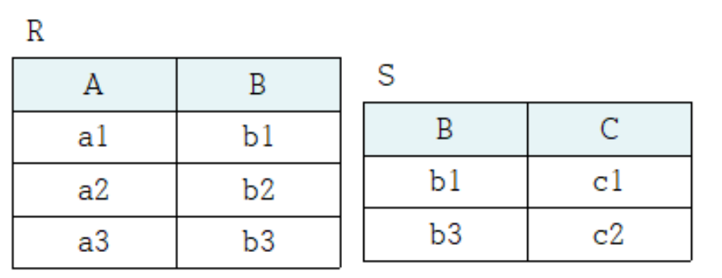

## 관계데이터 연산

관계 데이터 모델에서 원하는 데이터를 얻기 위해 릴레이션에 필요한 처리 요구를 수행하는 것

- 관계 대수 : 원하는 결과를 얻기 위해 데이터의 처리 과정을 순서대로 기술
- 관계 해석 : 원하는 결과를 얻기 위해 처리를 원하는 데이터가 무엇인지만 기술

새로운 데이터 언어가 제안되면 해당 데이터 언어의 유용성을 검증해야되는데, 검증의 기준 역할을 하는 것이 관계 대수와 관계 해석이다.

### 관계 대수
관계 대수는 릴레이션을 연산하는데, 피연산자인 릴레이션에 연산자를 적용해 얻은 결과도 릴레이션이다. 이러한 관계 대수의 특성을 폐쇄 특성이라 한다.

### 관계 대수 연산자
#### 1. 일반 집합 연산자 : 합집합, 교집합, 차집합, 카티션 프로덕트

  - (1) 연산을 위해 피연산자 2개가 필요하다.

  - (2) 합병 가능해야 한다
     - 두 릴레이션의 차수가 같다(속성 개수가 같다)
     - 2개의 릴레이션이 서로 대응되는 속성의 도메인이 같다.(속성의 이름은 달라도 된다.)

  - (3) (카티션 프로덕트는 합병 가능 여부와 상관 없이 연산이 가능)

  - 합집합, 교집합, 카티션 프로덕트는 교환적 특징과 결합적 특징을 가진다.
  - 차집합은 교환적 특징도 없고, 결합적 특징도 없다. 즉 연산 순서와 결합 순서가 중요하다.
  - 카티션 프로덕트 연산을 한 후 얻게 되는 결과 릴레이션의 차수는 피연산자인 릴레이션 R과 S의 차수를 더한 것과 같고, 카디널리티는 R과S의 카디널리티를 곱한 것과 같다.
  
#### 2. 순수 관계 연산자 : 셀렉트, 프로젝트, 조인, 디비전
- 릴레이션의 구조와 특성을 이용하는 연산자
  
(1)셀렉트
- 릴레이션에서 주어진 조건을 만족하는 튜플만 선택하여 결과 릴레이션을 구성한다. 튜플은 릴레이션에서 행에 해당되므로 셀렉트는 연산 대상 릴레이션의 수평적 부분집합으로 결과 릴레이션을 구성하는 수평적 연산자라 할 수 있음
- 교환적 특징 존재

(2)프로젝트
- 릴레이션에서 선택한 속성에 해당하는 값으로 결과 릴레이션을 구성한다. 수직적 부분집합을 생성하는 것이므로 수직적 연산자라 할 수 있음

(3)조인
- 릴레이션 하나로 원하는 데이터를 얻을 수 없을때 사용
- 두 릴레이션에 대해 카티션 프로덕트 연산을 수행한 후 조인 속성의 값이 같은 조건을 만족하는 튜플을 반환하는 셀렉트 연산을 수행한 것과 같다.
- 세타 조인은 비교 연산자를 통해 다양한 조인 조건을 표현할 수 있다.
- 세타 조인에서 "=" 연산자를 이용해서 조인 조건을 표현한 것이 동등 조인이고, 동증 조인의 결과 릴레이션에서 중복된 속성을 제거하는 것이 자연 조인이다.
  
(4)디비전
- R ÷ S 연산은 S의 모든 튜플과 관련 있는 릴레이션 R의 튜플로 결과 릴레이션을 구성한다.
- 릴레이션 S의 모든 속성과 도메인이 같은 속성을 릴레이션 R이 포함하고 있어야 한다.


#### 세미조인
- 릴레이션 S의 조인 속성으로만 구성한 릴레이션을 릴레이션 R에 자연조인하는 것
- 교환적 특성이 없으므로 R과 S의 세미조인과 S와 R의 세미조인의 결과는 다름
#### 외부조인
- 두 릴레이션에서 자연 조인 연산을 수행할 때 조인 속성 값이 같은 튜플이 상대 릴레이션에 존재하지 않아 조인 연산에서 제외된 모은 튜플을 결과 릴레이션에 포함시킨다. 이때 결과 릴레이션에 속성 값이 없는 경우는 NULL 값 처리


## 연습문제

#### 1. 릴레이션 A와 B가 합병 가능한지 여부를 판단하는 기준이 아닌 것은?
(1) - 두 릴레이션의 인스턴스가 달라도 합병이 가능하다.
```
1. 두 릴레이션의 인스턴스가 동일해야 한다.
2. 두 릴레이션의 차수가 동일해야 한다.
3. 두 릴레이션의 대응하는 속성의 이름은 달라도 상관없다.
4. 두 릴레이션의 대응하는 속성의 도메인은 동일해야 한다.
```

#### 2. 관계 대수와 관계 해석에 대한 설명으로 옳지 않은 것은?
(3) - 관계 해석이 수학의 프레디킷 해석에 기반을 두고 있다.
```
1. 관계 대수와 관계 해석은 데이터를 처리하는 기능과 처리를 요구하는 표현력에서 동등한 능력이 있다.
2. 관계 대수는 절차 언어이고, 관계 해석은 비절차 언어다.
3. 관계 대수는 수학의 프레디킷 해석에 기반을 두고 있다.
4. 관계 해석은 튜플 관계 해석과 도메인 관계 해석으로 분류된다.
```

#### 3. 관계 대수 연산자 중 일반 집합 연산자에 속하지 않는 것은?
(1) ÷  : 디비전 연산자는 순수 관계 연산자이다. 일반 집합 연산자에는 합집합, 교집합, 차집합, 카티션 프로덕트가 있다.

#### 4. 관계 대수 연산자 중 종류가 다른 것은?
(3) x : 카티션 프로덕트는 일반 집합 연산자이다.

#### 5. 릴레이션에서 조건을 만족하는 튜플들을 반환하는 관계 대수 연산자는?
(1) σ : 셀렉트 연산자에 대한 설명이다.

#### 6. 릴레이션에서 제시된 특정 속성들의 값으로만 구성된 튜플을 반환하는 관계 대수 연산은?
(2) project(π) : 프로젝트 연산에 대한 설명이다.

#### 7. 릴레이션 R의 각 튜플과 릴레이션 S의 각 튜플을 모두 연결하여 만든 새로운 튜플을 반환하는 연산자는?
(4) × : 카티션 프로덕트 연산자에 대한 설명이다.

#### 8. 공통 속성을 이용해 릴레이션 R과 S의 튜플들을 연결하여 만든 새로운 튜플들을 반환하는 관계 대수 연산은?
(3) join : 조인 연산에 대한 설명이다.

#### 9. 다음 중 교환적 특징을 가지지 않는 연산자는?
(3) - : 차집합은 교환적 특징과 결합적 특징을 모두 가지지 않는다.

#### 10. 관계 대수에 대한 설명으로 옳은 것은?
(3)
```
1. 처리를 원하는 데이터가 무엇인지만 기술하는 비절차 언어다. - 관계 해석
2. 튜플 관계 해석과 도메인 관계 해석이 있다.
3. 원하는 결과를 얻기 위해 릴레이션을 처리하는 연산자들의 집합으로, 피연산자와 결과가 모두 릴레이션이다.
4. 관계 대수는 수학의 프레디킷 해석에 기반을 두고 있다. - 관계해석
```

#### 11. 합병 가능한 두 릴레이션 R과 S가 있을 때, R-S 연산의 결과 릴레이션에 대한 설명으로 옳은 것을 모두 고르시오.
(A) (B) (D)
```
(A) 결과 릴레이션의 차수는 릴레이션 R의 차수와 같다.
(B) 결과 릴레이션의 차수는 릴레이션 S의 차수와 같다.
(C) 결과 릴레이션의 차수는 릴레이션 R의 차수에서 릴레이션 S의 차수를 뺀 것과 같다.
(D) 결과 릴레이션의 카디널리티는 릴레이션 R의 카디널리티와 같거나 적다.
(E) 결과 릴레이션의 카디널리티는 릴레이션 R의 카디널리티에서 릴레이션 S의 카디널리티를 뺀 것과 같다.
```

#### 12. 릴레이션 R의 차수가 5이고, 카디널리티가 8, 릴레이션 S의 차수가 3이고 카디널리티가 6일 때 두 릴레이션을 카티션 프로덕트한 결과 릴레이션의 차수와 카디널리티는?
- 차수 : 8
- 카디널리티: 48


#### 13. 다음 관계 대수 표현의 의미는?
```π제목, 평점(σ상영시간>=150∧감독이름='봉준호'(영화))```

상영 시간이 150분 이상이고 감독 이름이 봉준호인 영화의 제목과 평점을 검색하시오.

#### 14. 자연 조인 연산을 수행할 때 상대 릴레이션에 조인 속성 값이 같은 튜플이 존재하지 않아 조인 연산에서 제외되었던 모든 튜플을 결과 릴레이션에 포함시키는 조인 연산은?
외부 조인

#### 15. 관계 대수 조인 연산에서 중복된 속성이 한 번만 결과 릴레이션에 나타나는 것을 무엇이라 하는가?
자연 조인

#### 16. 관계 대수에 대한 설명으로 적합한 것을 모두 고르시오.
(A) (B) (C) (E)
```
(A) 원하는 데이터를 얻기 위한 처리 과정을 순서대로 기술하는 절차 언어다.
(B) 일반 집합 연산자와 순수 관계 연산자가 있다.
(C) 원하는 결과를 얻기 위해 릴레이션을 처리하는 연산자들의 집합으로, 피연산자와 결과가 모두 릴레이션이다.
(D) 수학의 프레디킷 해석에 기반을 두고 있다.
(E) 원하는 결과를 얻기 위해 수행해야 하는 연산의 순서를 명확히 제시해야 한다.
```

#### 17. 관계 해석에 대한 설명으로 옳은 것은?
(2) - 수학의 프레디킷 해석에 기반을 두고 있다.

#### 18. 관계 대수의 페쇄 특성을 설명하시오.
관계 대수의 연산 대상도 릴레이션이고, 연산 결과도 릴레이션이라는 것의 폐쇄 특성이라고 한다.

#### 19. 다음 설명을 읽고 빈칸을 적절히 채우시오.
관계적으로 완전

```
관계 대수나 관계 해석으로 기술할 수 있는 모든 데이터 처리 요구를 새로 제안된 데이터 언어가 기술할 수 있다면 그 언어를 () 하다고 말할 수 있다.
```

#### 20. 동등 조인과 자연 조인의 차이를 설명하시오.
세타 조인에서 "=" 연산자를 이용해서 조인 조건을 표현한 것이 동등 조인이고, 동증 조인의 결과 릴레이션에서 중복된 속성을 제거하는 것이 자연 조인이다.

#### 21. 다음이 설명하고 있는 관계 대수 연산자의 기호는 무엇인가?
÷ (디비전)
```
두 릴레이션 R, S에 대해 릴레이션 R의 모든 조건을 만족하는 튜플들을 릴레이션 S에서 분리해서 프로젝트하는 연산
```

#### 22. 다음이 설명하고 있는 관계 대수 연산자의 기호는 무엇인가?
\- (차집합)
```
두 릴레이션 R, S에 대해 릴레이션 R에는 존재하지만 릴레이션 S에는 존재하지 않는 튜플을 추출하는 연산
```

#### 23. 다음 설명을 읽고 각 물음에 답하시오.

```릴레이션 R의 차수가 3이고, 릴레이션 S의 차수가 4다. 그리고 두 릴레이션은 1개의 속성을 공통으로 가지고 있다.```

```
(1) 릴레이션 R과 S에 대해 동등 조인 연산을 수행한 경우 결과 릴레이션의 차수는 얼마인가? - 7개
(2) 릴레이션 R과 S에 대해 자연 조인 연산을 수행한 경우 결과 릴레이션의 차수는 얼마인가? - 6개
(3) 릴레이션 R과 S에 대해 세미 조인 연산(R⋉S)을 수행한 경우 결과 릴레이션의 차수는 얼마 인가? - 3개
(4) 릴레이션 R과 S에 대해 완전 외부 조인 연산(R⟗S)을 수행한 경우 결과 릴레이션의 차수는 얼마인가? - 6개
```

#### 24. 다음 두 릴레이션 R과 S를 보고 각 물음에 답하시오.


```
(1) R∪S 연산을 수행한 결과 릴레이션을 작성하시오.
(2) R∩S 연산을 수행한 결과 릴레이션을 작성하시오.
(3) R-S 연산을 수행한 결과 릴레이션을 작성하시오.
(4) S-R 연산을 수행한 결과 릴레이션을 작성하시오.
```
(1)


(2)


(3)


(4)


#### 25. 다음 세 릴레이션 R, S, T를 보고 각 물음에 답하시오.


```
(1) R÷S 연산을 수행한 결과 릴레이션을 작성하시오.
(2) R÷T 연산을 수행한 결과 릴레이션을 작성하시오.
```

(1)

(2)


#### 26. 다음 두 릴레이션에 대해 RXS 연산을 수행한 결과 릴레이션을 작성하시오.


결과 릴레이션:


#### 27. 다음 두 릴레이션 R과S를 보고 각 물음에 답하시오.


(1) 동등 조인<br>


(2) 자연 조인<br>


(3) 세미 조인<br>


(4) 왼쪽 외부 조인<br>


(5) 오른쪽 외부 조인<br>


(6) 완전 외부 조인<br>


#### 28. 다음 두 릴레이션 R, S를 보고 각 물음에 답하시오.


(1) σB=’b3’(S) 연산을 수행한 결과 릴레이션을 작성하시오<br>
=> 셀렉트 연산 : B가 b3인 튜플 가져오기
<br>


(2) πB, C(R ⋈N S) 연산을 수행한 결과 릴레이션을 작성하시오<br>
=> 조인 : R과 S를 자연 조인
=> 프로젝트 연산 :  조건에 부합하는 릴레이션의 속성(B, C)을 추출한다.
<br>


(3) πA, B(σC=’c3’(R)) 연산을 수행한 결과 릴레이션을 작성하시오<br>
=> 셀렉션 연산 : R릴레이션에서 C속성이 'c3'인 튜플 가져오기
=> 프로젝트 연산 : A, B 속성 가져오기
<br>


(4) R⟖S 연산을 수행한 결과 릴레이션의 투플 개수는 몇 개인가?<br>
R릴레이션을 S 릴레이션을 왼쪽 외부조인한 결과 튜플의 개수는 4개이다


#### 29. 다음 3개의 릴레이션 스키마를 보고 각 물음에 답하시오.


```
(1) 모든 과목의 이름을 검색하는 질의문을 관계 대수로 표현하시오.
-> π과목이름(과목)

(2) 1학년 학생의 학번과 이름을 검색하는 질의문을 관계 대수로 표현하시오.
-> π학번, 이름(σ학년=1(학생))

(3) 중간성적이 80점 이상이고 기말성적이 70점 이상인 학생의 학번과 수강한 과목번호, 학점을 검색하는 질의문을 관계 대수로 표현하시오.
-> π학번, 과목번호, 학점(σ중간성적>=80⋀기말성적>=70(수강))

(4) 모든 과목을 수강하고 있는 학생의 학번을 검색하는 질의문을 관계 대수로 표현하시오.
-> π학번(수강 ÷ π과목번호(과목))

(5) 3번 과목에서 A0 학점을 받은 학생의 이름과 학년을 검색하는 질의문을 관계 대수로 표현하시오.
π이름, 학년(σ과목번호=3⋀학점=‘A0’(학생 ⋈ 수강))
```


#### 30. 다음 4개의 릴레이션 스키마를 보고 각 물음에 답하시오.


(1) 수수료가 5%미만인 판매자의 번호와 이름을 검색<br>
**(판매자 where 수수료<5)[판매자번호, 이름]**

(2) C001 고객이 주문한 P003 제품의 판매자 이름과 수수료를 검색<br>
**(판매자 ⋈ (주문 where 고객번호=’C001’ and 제품번호=‘P003’))[이름, 수수료]**

(3) A005 판매자에게 주문하지 않은 고객의 이름을 모두 검색<br>
**고객[이름] - ((주문 where 판매자번호=’A005’) ⋈ 고객)[이름]**

(4) 대구에 거주하는 모든 고객으로부터 주문을 받은 판매자의 번호<br>
**주문[판매자번호, 고객번호] ÷ (고객 where 거주도시=‘대구’)[고객번호]**

(5) 주문된 적이 있는 제품에 대해서만 제품명과 가격을 검색<br>
**(제품 ⋉ 주문) [제품명, 가격]**