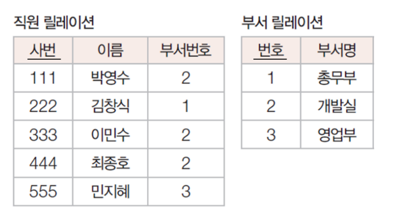
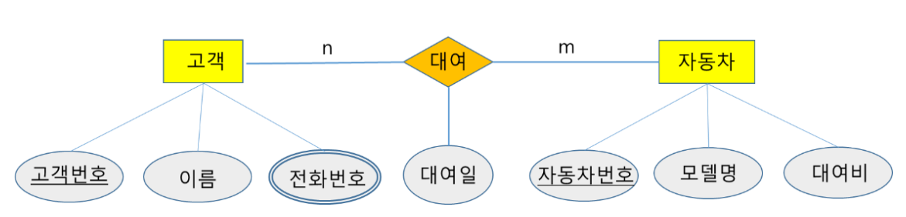
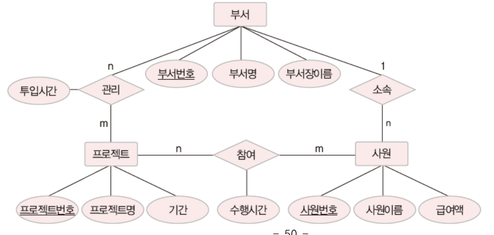

## 데이터베이스 설계

### 데이터베이스 설계 과정

1단계: 요구사항 분석 - 데이터베이스의 용도 파악

2단계: 개념적 설계 - DBMS에 독립적인 개념적 구조 설계

3단계: 논리적 설계 - DBMS에 적합한 논리적 구조 설계

4단계: 물리적 설계 - DBMS로 구현 가능한 물리적 구조 설계

5단계: 구현 - SQL문을 작성한 후 이를 DBMS에서 실행하여 데이터베이스 생성

### 논리적 설계와 릴레이션 스키마 변환 규칙

규칙1 : 모든 개체는 릴레이션으로 변환한다.

규칙2 : 다대다(N:M) 관계는 릴레이션으로 변환한다.

규칙3 : 일대다(1:N) 관계는 외래키로 표현한다.

규칙4 : 일대일(1:1) 관계는 외래키로 표현한다.

규칙5 : 다중 값 속성은 독립 릴레이션으로 변환한다.


## 연습문제
#### 9. 다음 요구사항을 릴레이션 스키마로 설계했을 때, 가장 적절한 것은?
학생(학번, 이름, 지도교수ID, 지도내용, 멘토, 멘토링내용)

교수(교수ID, 이름)
```
대학에서 1,2 학년 학생은 교수로부터 진로 지도를 받는다(교수:학생 1:N관계)
학생들 사이에도 멘토링을 실시하며, 멘티인 1학년 학생이 멘토인 2학년 학생으로부터 조언을 받는다(멘토:멘티 1:N관계)
```

#### 10. 부서 개체와 직원 개체가 관리 관계를 맺고 있음을 나타낸 E-R 다이어그램을 릴레이션 스키마로 표현하고 다음과 같이 데이터가 주어졌을 때, 관리 관계에 대한 설명으로 옳지 않은 것은? 단, <직원 릴레이션>의 부서번호는 <부서 릴레이션>의 번호를 참조하는 외래키다.
옳지 않은 것은 1, 2, 4임
(3)번만 옳음. 옳은 것을 고르라는 문제가 오타난 듯함.



```
(1) 관리 관계는 직원에서 부서쪽으로 1:N 관계다
(2) 관리 관계는 N:M 관계다.
(3) 관리 관계는 부서에서 직원쪽으로 1:N 관계다.
(4) 관리 관계는 1:1 관계다
```

#### 15. 다음 E-R 다이어그램을 릴레이션 스키마로 변환하시오.


```
고객("고객번호", 이름)
자동차("자동차번호" 모델명, 대여비)
대여("고객번호 자동차번호", 대여일)
고객-전화번호("고객번호, 전화번호")
```

#### 16. 다음 E-R 다이어그램을 릴레이션 스키마로 변환하시오.


```
부서("부서번호", 부서명, 부서장이름)
사원("사원번호", 사원이름, 급여액, 부서번호(FK))
프로젝트("프로젝트번호", 프로젝트명, 기간)
프로젝트관리("부서번호 프로젝트번호", 투입시간)
프로젝트참여("프로젝트번호 사원번호", 수행시간 )
```