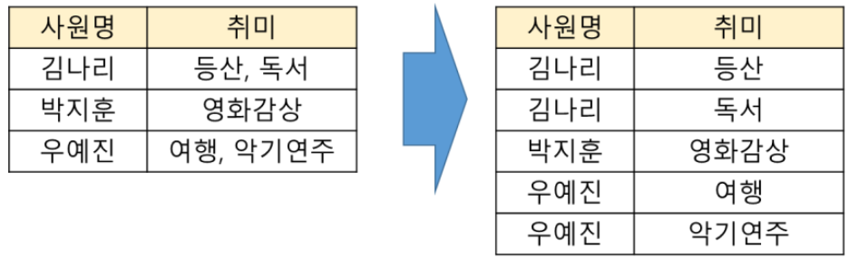
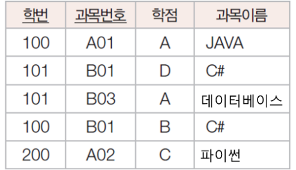
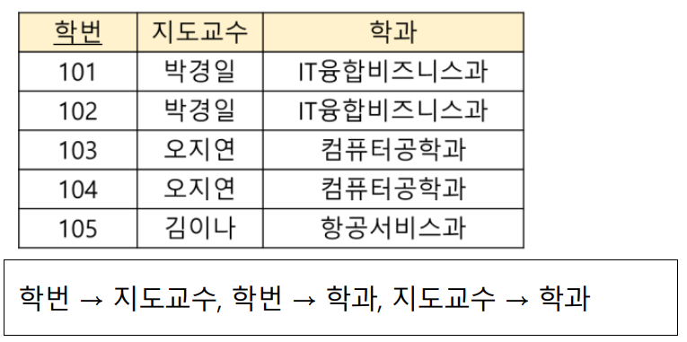
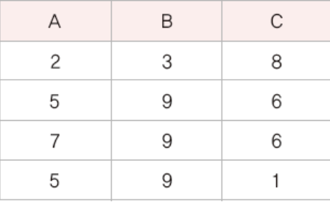
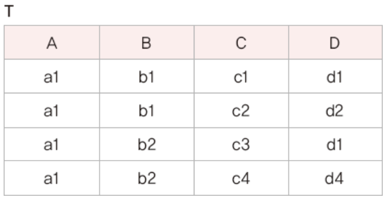
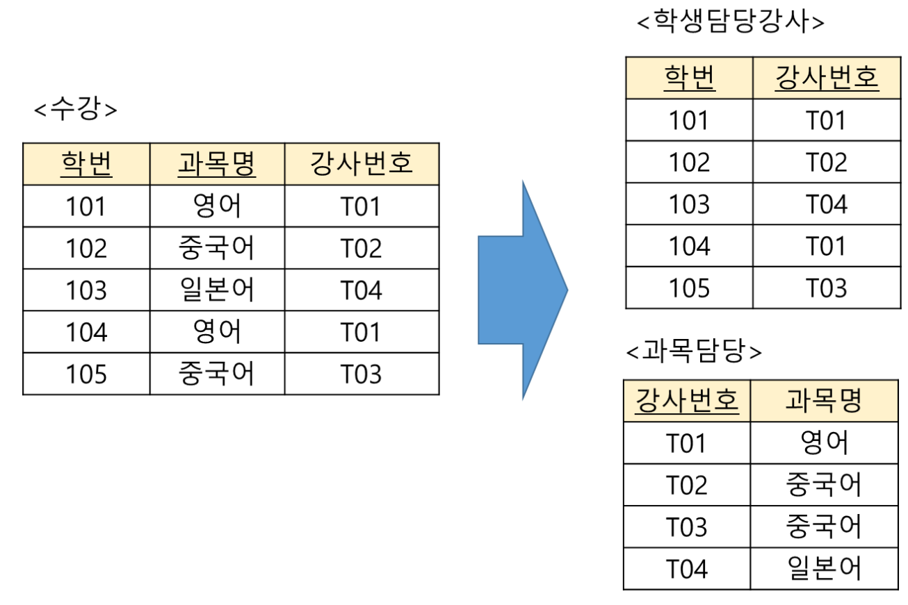
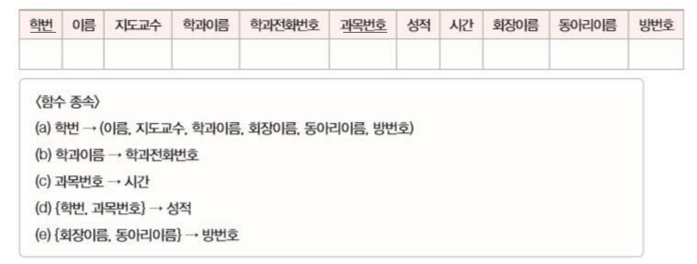

## 정규화의 개념과 이상 현상

정규화 : 데이터베이스 설계 후에 결과물을 검증하기 위해 사용
이상 현상 : 데이터베이스를 잘못 설계해서 불필요한 데이터 중복이 발생하여 릴레이션에 대한 삽입, 수정, 삭제 연산을 할 때 부작용이 발생하는 것

### 이상 현상의 종류

1. 삽입 이상 : 새 데이터를 삽입하기 위해 불필요한 데이터도 함께 삽입해야 하는 문제
2. 갱신 이상 : 중복 튜플 중 일부만 변경하여 데이터가 불일치하게 되는 모순의 문제
3. 삭제 이상 : 튜플을 삭제하면 꼭 필요한 데이터까지 함께 삭제되는 데이터 손실의 문제

- 이상 현상이 발생하는 이유는 관련 없는 속성들을 하나의 릴레이션에 모아두기 때문이다. 따라서 관련 있는 속성들로만 릴레이션을 구성해야 하는데, 정규화를 통해 이를 실현할 수 있다.

- 정규화 과정에서 고려해야 하는 속성들 간의 관련성을 함수적 종속성이라고 한다.

### 함수 종속
릴레이션 내의 모든 튜플에서 X값에 대한 Y값이 항상 하나인 경우
- X가 Y를 함수적으로 결정한다
- Y가 X에 함수적으로 종속되어 있다.
- X -> Y
- X: 결정자 / Y: 종속자

함수 종속 관계를 판단할 때 유의할 점 : 현재 시점에 릴레이션에 포함된 속성 값만으로 판단하면 안된다. 릴레이션에서 속성 값은 계속 변할 수 있기 때문에 속성 자체가 가지고 있는 특성과 의미를 기반으로 판단해야 한다.

일반적으로 튜플을 유일하게 구별하는 기본키와 후보키는 그 턱성 때문에 결정자가 될 수 있다. 하지만, 기본키나 후보키외에도 결정자가 될 수 있는 속성이 존재할 수 있다.

```
고객 아이디 -> 고객 이름
{고객 아이디, 이벤트 번호} -> 당첨 여부
{고객 아이디, 이벤트 번호} -> 고객 이름

{고객 아이디, 이벤트 번호}에 종속 되어 있는 고객 이름은 {고객 아이디, 이벤트 번호}의 일부분인 고객 아이디에서도 종속되어 있다. 이런 경우 고객 이름 속성이 {고객 아이디, 이벤트 번호} 속성 집합에 부분 함수 종속되어있다고 한다.
반면에, 당첨 여부는 {고객 아이디, 이벤트 번호}의 일부분이 아닌 속성 집합 전체에 종속되어 있다. 이런 경우에는 당첨여부 속성이 {고객 아이디, 이벤트 번호} 속성 집합에 완전 함수 종속되었다고 한다. 
```

### 기본 정규형과 정규화 과정

#### 정규화의 개념과 종류
정규화 : 함수 종속성을 이용하여 릴레이션을 연관성이 있는 속성들로만 구성되도록 분해해서 이상현상이 발생하지 않는 올바른 릴레이션으로 만들어나가는 과정

(1) 기본 정규형 - 제1정규형, 제2정규형, 제3정규형, 보이스/코드 정규형<br>
(2) 고급 정규형 - 제4정규형, 제5정규형

- 정규형의 차수가 높아질수록 요구되는 조건이 많아지고 엄격해진다.
- 정규화 과정에서 릴레이션을 분해할 때 주의할 점은 분해된 릴레이션들을 자연 조인하여 분해 전의 릴레이션으로 복원할 수 있어야 한다는 것이다. 의미상 동등한 릴레이션들로 분해되어야 하고, 분해했을 때 정보 손실이 발생하지 않아야 한다. 정보 손실이 발생하지 않게 분해하는 것을 무손실 분해라고 한다.

1. 제1정규형
- 릴레이션에 속한 모든 속성의 도메인이 원자값으로만 구성되어 있으면 제1정규형에 속한다.

2. 제2정규형
- 릴레이션이 제1정규형에 속하고, 기본키가 아닌 모든 속성이 기본키에 완전함수 종속되면 제2정규형에 속한다.

3. 제3정규형
- 릴레이션이 제2정규형에 속하고, 기본키가 아닌 모든 속성이 이행적 함수 종속이 되지 않으면 제3정규형에 속한다.
- 이행적 함수 종속 : X -> Y, Y -> Z가 존재하면 X -> Z가 성립하고, 이때 Z가 X에 이행적으로 함수 종속되었다고 한다.

4. 보이스/코드 정규형
- 릴레이션의 함수 종속 관계에서 모든 결정자가 후보키이면 보이스/코드 정규형에 속한다.


## 연습 문제

#### 1. 정규화에 대한 설명으로 옳지 않은 것은?
(4) - 잘못 설계된 릴레이션들을 분해하면서 문제를 해결하는 것이다.
```
(1) 논리적 데이터베이스 설계 방법 중 하나다.
(2) 좋은 데이터베이스 스키마를 생성하고 불필요한 데이터 중복을 방지하는 데 목적이 있다.
(3) 정규형에는 제1정규형, 제2정규형, 제3정규형, 보이스/코드 정규형, 제4정규형, 제5정규형 등이 있다.
(4) 속성들 간의 종속 관계를 분석하여 잘못 설계된 릴레이션들을 결합하면서 문제를 해결한다.
```

#### 2. 정규화의 필요성으로 거리가 먼 것은?
(2) - 데이터 중복을 최소화하는 것이다.
```
(1) 수정, 삭제 시 이상 현상을 최소화한다.
(2) 데이터 중복을 활성해서 효과적인 검색을 지원한다.
(3) 릴레이션을 분해하여 관련있는 속성들로만 릴레이션을 구성한다.
(4) 릴레이션 구조의 안정성을 최대화한다.
```

#### 3. 정규화를 하지 않으면 릴레이션을 조작할 때 데이터 중복 때문에 곤란한 현상이 발생할 수 있다. 이러한 이상 현상에 해당하지 않는 것은?
검색 이상

#### 4. 다음 중 릴레이션을 조작할 때 발생할 수 있는 이상 현상에 관한 설명으로 옳지 않은 것은?
(4) - 분해하면서 해결하는 것이다.
```
(1) 이상은 속성들 간에 존재하는 여러 종류의 종속 관계를 하나의 릴레이션에 표현할 때 발생한다.
(2) 데이터를 삽입할 때 불필요한 데이터가 삽입되는 현상을 삽입 이상이라 한다.
(3) 릴레이션의 한 튜플을 삭제할 때 연쇄 삭제로 인해 꼭 필요한 데이터가 함께 삭제되는 현상을 삭제 이상이라 한다.
(4) 속성들 간의 종속 관계를 분석하여 여러 개의 릴레이션을 하나로 결합하면서 이상 현상을 해결한다.
```

#### 5. 어떤 릴레이션 R에서 X와 Y를 각각 R의 속성 집합의 부분집합이라고 할 경우 속성 X의 값 각각에 대해 시간에 관계 없이 항상 속성 Y의 값이 오직 하나만 연관되어 있을 때 Y가 X에 함수적으로 종속되어 있다고 한다. 이를 기호로 옳게 표기한 것은?
(4) X -> Y

#### 6. 어떤 릴레이션에 속한 모든 속성이 원자 값만 가지며, 기본키가 아닌 속성 모두가 기본키에 완전 함수 종속이지만 이행적 함수 종속이 나타나면 어떤 정규형에 해당하는가?
(2) 제2정규형

#### 7. 이행적 함수 종속 관계를 의미하는 것은?
(1) A -> B 이고 B -> C일 때, A -> C를 만족하는 관계

#### 8. 정규화 과정 중 제1정규형에서 제2정규형이 되기 위한 조건은?
(4) 제1정규형을 만족하고 기본키가 아닌 모든 속성이 기본키에 완전 함수 종속되어야 한다.

#### 9. 제2정규형에서 제3정규형이 되기 위한 조건은?
(1) 이행적 함수 종속 제거

#### 10.정규화에 관한 설명으로 옳지 않은 것은?
(4) - 제2정규형을 만족하고, 이행적 함수 종속을 제거하면 제3정규형에 해당한다.
```
(1) 모든 속성의 도메인이 원자 값만 가지면 릴레이션은 제1정규형에 해당한다.
(2) 정규화는 제1정규형에서 제5정규형으로 갈수록 만족시켜야할 제약조건이 많아진다.
(3) 릴레이션이 제1정규형을 만족하면서, 기본키가 아닌 모든 속성이 기본키에 완전 함수 종속이면 제2정규형에 해당한다.
(4) 릴레이션이 제2정규형을 만족하고, 결정자이면서 후보키가 아닌 것을 제거하면 제3정규형에 해당한다.
```

#### 11. 다음과 같이 왼쪽 릴레이션을 오른쪽 릴레이션으로 정규화하였다. 오른쪽 릴레이션은 어떤 정규형에 속하는가?
(1) - 제1정규형


#### 12. 수강 릴레이션이 다음과 같을 때, 수강 릴레이션에 대한 설명으로 옳지 않은 것은?
(1) - 과목이름은 {학번, 과목번호}에 부분 함수 종속되어 있으므로 제2정규형을 만족시키지 않는다.

```
(1) 제2정규형을 만족시킨다.
(2) 아직 수강 학생이 없는 새로운 과목을 삽입할 때 삽입 이상이 발생한다.
(3) 학번이 101인 학생이 수강을 취소하면 삭제 이상이 발생한다.
(4) 과목이름을 수정하려 할 때 갱신 이상이 발생할 수 있다.
```

#### 13. A, B, C, D 속성으로 구성된 릴레이션 R은 {A,B}가 기본키다. 함수 종속이 다음과 같은 경우, 이 릴레이션은 어떤 정규형에 속하는가.
제1정규형
C는 {A,B}에 부분 함수 종속되어 있으므로, 제1정규형만을 만족한다.
```
{A, B} -> C    {A, B} -> D     B -> C    C -> D
```

#### 14. 지도 릴레이션이 다음과 같은 함수 종속성을 가지고 있을 때 지도 릴레이션에서 발생할 수 있는 이상 현상이 아닌 것은?
(4) 김이나 교수의 소속이 항공서비스과라는 데이터를 삭제해도 학번이 105인 학생의 데이터가 함께 삭제되는 것은 아니다.


#### 15. 다음 설명을 읽고 각 물음에 답하시오.
```
X - > Y가 성립하고, Y -> Z도 성립하면 X -> Z가 성립한다.
```

```
(1) 어떤 함수 종속 관계와 관련된 설명인가?
이행적 함수 종속
(2) 정규화 과정에서 이러한 함수 종속 관계를 제거하는 단계는?
2NF -> 3NF (제2정규형 -> 제3정규형)
```

#### 16. 잘못 설계된 릴레이션을 조작할 때 발생하는 이상 현상 중 다음이 설명하는 것은?
갱신 이상
```
중복된 튜플 중에서 일부 튜플의 속성 값만을 변경함으로써 정보의 모순성이 생기는 현상
```

#### 17. 다음 릴레이션에 존재하는 함수 종속성을 모두 찾으시오.
A->B


#### 18. 제3정규형에서 보이스/코드 정규형으로 정규화하기 위해서는 어떤 작업이 필요한가?
결정자가 후보키가 아닌 함수 종속을 제거해서, 모든 결정자가 후보키가 되도록 하는 작업

#### 19. 정규화에 대한 설명으로 옳은 것을 모두 고르시오.
B, C, D
```
(A) 정규화는 릴레이션을 결합하여 종속성을 증가시키는 것이다 - X
(B) 제2정규형은 반드시 제1정규형을 만족해야 한다. - O
(C) 제1정규형은 모든 속성의 도메인이 원자 값만으로 되어있는 릴레이션이다. - O
(D) 보이스/코드 정규형은 강한 제3정규형이라고도 한다. - O
```

#### 20. 데이터베이스 이상 현상의 종류 세 가지를 간단히 설명하시오.
삽입 이상 : 새 데이터를 삽입하기 위해 불필요한 데이터도 함께 삽입해야 하는 문제<br>
갱신 이상 : 중복 튜플 중 일부만 변경하여 데이터가 불일치하게 되는 모순의 문제<br>
삭제 이상 : 튜플을 삭제하면 꼭 필요한 데이터까지 함께 삭제되는 데이터 손실의 문제

#### 21. 다음과 같은 함수 종속성을 가지는 릴레이션은 어떤 정규형에 속하는가? 단, A가 기본키다.
제2정규형, 기본키가 아닌 모든 속성이 기본키에 완전함수 종속되지만, 이행적 함수 종속이 존재하기 때문에 제2정규형을 만족한다.
```
A -> {B, C, D}       B -> C
```

#### 22. 다음과 같은 함수 종속성을 가지는 릴레이션은 어떤 정규형에 속하는가? 단, {A, B}가 기본키다.
제1정규형, C가 {A, B}에 부분 함수 종속되어 있으므로 제1정규형이다.
```
{A, B}-> C     {A, B}-> D      B -> C
```

#### 23. 다음과 같은 함수 종속성을 가지는 릴레이션은 어떤 정규형에 속하는가? 단, {A, B}가 기본키다.
제3정규형, 기본키가 아닌 모든 속성이 기본키에 완전함수 종속되어있고, 이행적 함수 종속을 포함하지 않으므로 제3정규형이다. 하지맘ㄴ, 후보키가 아닌 결정자가 존재하므로 보이스/코드 정규형은 아니다.
```
{A, B}-> C     C -> B
```

#### 24. 보이스/코드 정규형에 대한 설명으로 옳은 것을 모두 고르시오.
A, B, C
```
(A) 보이스/코드 정규형에 속하는 릴레이션은 반드시 제3정규형에 속한다 - O
(B) 제3정규형에 속하지만 보이스/코드 정규형에 속하지 않는 릴레이션도 있다 - O
(C) 모든 결정자가 후보키인 릴레이션이 보이스/코드 정규형에 속한다 - O
(D) 이행적 함수 종속을 제거한 릴레이션은 보이스/코드 정규형에 속한다 - X
```

#### 25. 다음 릴레이션 T에 존재하는 함수 종속성을 모두 구하시오.
- B -> C
- C -> {A, C, D}
- D -> A
- {A, C} -> {B, D}
- {B, C} -> {A, D}
- {C, D} -> {A, B}
- {B, D} -> {A, C}
- {A, B, C} -> D
- {A, B, D} -> C
- {B, C, D} -> A
- {A, C, D} - > B



#### 26. 다음과 같은 수강 릴레이션을 학생담당강사 릴레이션과 과목담당 릴레이션으로 정규화하였다. 학생 담당강사와 과목담당 릴레이션은 어떤 정규형에 해당하는가?
보이스/코드 정규형




#### 27. 다음 릴레이션의 함수 종속성을 보고 물음에 답하시오.



```
(1) 위의 릴레이션에서 발생 가능한 삽입, 갱신, 삭제 이상 문제를 예를 들어 설명하시오.
삽입 이상 : 과목번호가 아직 없는 학생을 삽입할 때 문제가 발생
갱신 이상 : 동일한 학번의 학생에 대해 중복 데이터가 저장되는데, 학과이름이 변경된다면 해당학번의 모든 튜플들에 대한 데이터를 갱신해야된다.
삭제 이상: 과목을 한개만 듣는 학생이 있을 때, 그 학생의 데이터를 삭제하면, 그 학생이 갖고 있는 학번, 이름, 지도교수, 학과이름, 회장이름, 동아리이름, 방번호에 해당하는 데이터를 잃게된다.

(2) 모든 릴레이션이 제2정규형을 만족하도록 분해하고, 각 릴레이션의 기본키도 표시하시오.
A - {학번},  이름, 지도교수, 학과이름, 회장이름, 동아리이름, 방번호, 학과전화번호
B - {과목번호}, 시간
C - {학번, 과목번호}, 성적

(3) (2)의 모든 릴레이션이 제3정규형을 만족하도록 분해하고, 각 릴레이션의 기본키도 표시하시오.
A1 - {학번},  이름, 지도교수, 학과이름, 회장이름, 동아리이름
A2 - {학과이름}, 학과전화번호
A3 - {회장이름, 동아리이름}, 방번호
B - {과목번호}, 시간
C - {학번, 과목번호}, 성적

(4) (3)의 모든 릴레이션이 보이스/코드 정규형을 만족하도록 분해하고, 각 릴레이션의 기본키도 표시하시오.
위에서 분해한것과 동일
A1 - {학번},  이름, 지도교수, 학과이름, 회장이름, 동아리이름
A2 - {학과이름}, 학과전화번호
A3 - {회장이름, 동아리이름}, 방번호
B - {과목번호}, 시간
C - {학번, 과목번호}, 성적

```